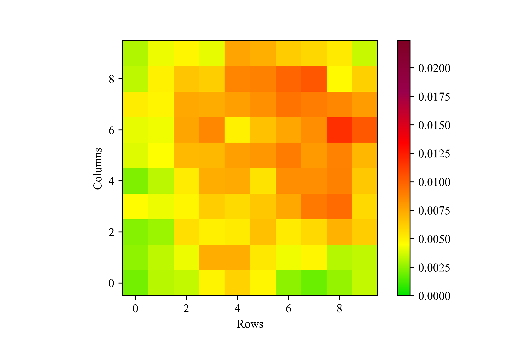

# experimental record

## experiment 1

### Environment

- a 20 * 20 rectangle road network with grids containing 4 intersections(nodes)
- Episode over conditions: get more than 60% weight(reward) in network or episode duration time exceeds 3600 * 24 * 4 seconds.

#### timestep

- Define timestep is unit time interval(3 min). When pass one unit time interval, environment is to the next timestep. In per timestep, every vehicle needs to make the next direction to go, and environment decides the vehicles' final path according to vehicles' location, vehicles' decision, unit time interval, shortest path.
- In every timestep, vehicle may be at an intersection, or it may be on the road.

#### reward

- Environment has 20 * 20 / 4 number of grids. Every grid has random weight(reward) with uniform distribution. Sum of all grids' rewards is equal to 1. When reset environment, Every grid's weight is updated randomly and sum is also equal to 1.
- When a vehicle passes a grid, this grid's reward has been consumed.
- Vehicles get the same reward when execute action to next timestep. For example, vehicle A arrives at grid A with 0.02 weight which has no vehicle arrived at, and vehicle B arrives at grid B with 0.003 weight which has no vehicle arrived at, environment returning 0.02 + 0.003 point as final reward for every vehicle.
- Environment returning reward plus a constant negative value(- 0.05) as final reward.

#### state

Use these as policy input.

- every vehicle's location and it's own location, such as [[15, 17, 16, 17], [-1, -1, 12, 13], [15, 17, 16, 17], [5, 7, 5, 8]] (as the second vehicle's input, 3 vehicles in total, array[:, 0: 2] representing vehicle's starting node, array[:, 2: 4] representing vehicle's ending node, array[1] representing the first vehicle's location, array[3] representing the third vehicle's location and so on, array[0] representing the second vehicle's location same as the array[2] because of this array regard as the second vehicle's input)

- current node's weight from grid's weight, with the same shape as road network, 20 * 20

#### action

- Have 4 directions at most, 2 direction at least to select due to vehicle's location.
- Environment calculates the shortest path to the nodes a vehicle can reach per unit time interval. Choose the node from nodes with smallest angle with direction made by vehicle as final node and it's path way as vehicle's path.

### model

- Use PPO as policy without sharing actor parameters with critic.
- Every vehicle shares one policy to control them.
- Vehicle's location features' input to DNN input layers and node's weight input to CNN input layers, concatenating two input layers results as final output DNN layers input.

### result

- Model cannot converge in one vehicle condition.
- Model cannot converge in many vehicles condition.

### discussion

possible problems

- Reward design may not lead to optimize our objective. Find the implementation of environment(maybe Atari games) with the objective maximizing scores in fixed time interval.
- Location state as input may needs to be encoded. Without encoded can express geographical relation. Or input sparse matrix  with 0 and 1, and same shape as road network.
- There may be some bug on implementation of environment or policy. Check it.
- There is hidden state and transformation between making action decision and final executed action which policy cannot learn it's rule.

## experiment 2

### Environment

same to experiment 1

#### timestep

same to experiment 1

#### reward

- same to experiment 1
- Fix node weight(in every reset, node weights are the same).

#### state

Use these as policy input.

- Node's weight is same to experiment 1.

- Change location state features to matrix with the same shape as Node's weight. Use two sparse matrix to respectively represent corresponding vehicle's location and all vehicles' location. If vehicle's location is on node (13, 14), matrix row 14 column 15 is equal to 1, other no vehicle's location is equal to 0. Matrix one only marks one corresponding vehicle's location and Matrix two marks all vehicle's location.

#### action

same to experiment 1

### model

- RL model is the same to experiment 1.
- Use only CNN as input layers receiving all features, and DNN as output layers.

### result

- Model converged to average 10000 seconds cost until episode over in one vehicle condition(in random policy, finishing an episode needs about 90000 seconds cost).

### discussion

- Results proves experiment 1 has wrong feature engineering.
- Then try same model on the dynamic node weight.

## experiment 3

### Environment

same to experiment 2

#### timestep

same to experiment 2

#### reward

same to experiment 1

#### state

same to experiment 2

#### action

same to experiment 2

### model

same to experiment 2

### result

| the number of vehicles | last 100 episode | first 100 episode | the shortest 100 episode |
| ---------------------- | ---------------- | ----------------- | ------------------------ |
| 1                      | 14929            | 92967             | 10720                    |
| 2                      | 12825            | 45137             | 7468                     |
| 4                      | 9280             | 17481             | 4099                     |
| 10                     | 3163             | 4884              | 1512                     |
| 20                     | 1492             | 1671              | 642                      |

Last 100 episode: the last 100 episodes mean time cost(seconds), could represent the performance of trained policy.

First 100 episode: the first 100 episodes mean time cost(seconds), could represent the performance of random policy.

The shortest 100 episode: the shortest 100 episodes mean time cost(seconds), could represent the best performance of policy.

### discussion

- In one vehicle condition, model can find a well policy, but the more vehicles there are, the harder it is to find a better policy.

possible problems

- Reward design may lead to this result. When step to next timestep, all vehicle receive the same reward. It maybe causes vehicle to confuse the value of its own behavior with that of other vehicles. Try to give a greedy reward and a corporative reward to vehicle.

## experiment 4

### Environment

same to experiment 3

#### timestep

same to experiment 3

#### reward

- Return reward swatch to every vehicle's own rewards earned(greedy reward), not sum of all.
- Others are same to experiment 3.

#### state

same to experiment 3

#### action

same to experiment 3

### model

same to experiment 3

### result

| the number of vehicles | last 100 episode | first 100 episode | the shortest 100 episode |
| ---------------------- | ---------------- | ----------------- | ------------------------ |
| 2                      | 13657            | 43528             | 8046                     |
| 4                      | 7662             | 17626             | 3971                     |
| 10                     | 2955             | 4885              | 1492                     |
| 20                     | 1354             | 1672              | 614                      |

### discussion

- When number of vehicles is more than 2, optimal policy is better than that in returning same reward(experiment 3). This result maybe partially proved same reward causes vehicle to confuse the value of its own behavior with that of other vehicles. Try to give a greedy reward(help to distinguish the value of its own behavior from that of other vehicles) plus the mean of all greedy reward(encourage collaboration).

## experiment 5

### Environment

same to experiment 4

#### timestep

same to experiment 4

#### reward

- Return reward swatch to every vehicle's own rewards earned(greedy reward) plus mean of all.
- Others are same to experiment 4.

#### state

same to experiment 4

#### action

same to experiment 4

### model

same to experiment 4

### result

| the number of vehicles | last 100 episode | first 100 episode | the shortest 100 episode |
| ---------------------- | ---------------- | ----------------- | ------------------------ |
| 2                      | 11990            | 42730             | 7249                     |
| 4                      | 7460             | 16961             | 4167                     |
| 10                     | 3105             | 4885              | 1525                     |
| 20                     | 1315             | 1672              | 610                      |

There is another notable result below when change constant negative reward value to -0.005.

| the number of vehicles | last 100 episode | first 100 episode | the shortest 100 episode |
| ---------------------- | ---------------- | ----------------- | ------------------------ |
| 2                      | 12406            | 42195             | 7207                     |
| 4                      | 9173             | 18561             | 5040                     |
| 10                     | 3293             | 5088              | 1661                     |
| 20                     | 1419             | 1672              | 702                      |

### discussion

- It is obviously that own rewards plus mean can promote policy, but when the number of vehicles is 10, policy becomes weak. This phenomenon indicates that the result may be leaded by randomness, but it's worth trying again this reward type with more weight(in this experiment, mean weight is equal to 1).
- Another notable result indicates that constant negative reward value could affect the performance of the policy, which is a parameter that needs to be adjusted.

## experiment 6

### Environment

same to experiment 5

#### timestep

same to experiment 5

#### reward

- Return reward swatch to every vehicle's own rewards earned(greedy reward) plus the weighted mean of all. Try the case where the weights are equal to 0.5 and 1.5.
- Others are same to experiment 5.

#### state

same to experiment 5

#### action

same to experiment 5

### model

same to experiment 5

### result

result with 0.5 weight

| the number of vehicles | last 100 episode | first 100 episode | the shortest 100 episode |
| ---------------------- | ---------------- | ----------------- | ------------------------ |
| 2                      | 11670            | 45706             | 7115                     |
| 4                      | 6779             | 17585             | 3971                     |
| 10                     | 3165             | 4885              | 1463                     |
| 20                     | 1260             | 1672              | 538                      |

result with 1.5 weight

| the number of vehicles | last 100 episode | first 100 episode | the shortest 100 episode |
| ---------------------- | ---------------- | ----------------- | ------------------------ |
| 2                      | 11438            | 39739             | 7119                     |
| 4                      | 7070             | 19178             | 3886                     |
| 10                     | 3140             | 4885              | 1570                     |
| 20                     | 1367             | 1672              | 625                      |

### discussion

Except for the case where the vehicle is equal to 10, setting the weight to 0.5 is better. I think maybe 10 cars is close to saturation for the current environment, because the optimized policy is not significantly better than the random policy. It is necessary to set up a independent testing environment to analyze the relationship between the number of vehicles and the weight of rewards.

## experiment 7

### Environment

same to experiment 6

#### timestep

same to experiment 6

#### reward

same to experiment 4(greedy reward)

#### state

Use these as policy input.

The shape of the input data is basically the same as Experiment 4, except that all matrix data is flattened. This approach is more general and can be used for any shape of the network, as long as the node weight and position information is converted into the array form like this.

#### action

same to experiment 6

### model

- The format of the model is basically the same as Experiment 4, except the convolution layer is replaced from 2-dimensional convolution to 1-dimensional convolution.

### result

| the number of vehicles | test_cost | random_cost | the shortest 100 episode |
| ---------------------- | --------- | ----------- | ------------------------ |
| 2                      | 15638     | 48627       | 8795                     |
| 4                      | 11043     | 17712       | 6257                     |
| 6                      | 6536      | 10647       | 3429                     |
| 8                      | 5506      | 6489        | 2565                     |
| 10                     | 3802      | 4923        | 1730                     |
| 12                     |           |             |                          |
| 16                     |           |             |                          |
| 20                     |           |             |                          |

test_cost: the performance of well trained policy in test environment(the average of 100 episodes time cost).

random_cost: the performance of random policy in test environment(the average of 100 episodes time cost).

The shortest 100 episode: the shortest 100 episodes mean time cost(seconds), could represent the best performance of policy.

### discussion

All performance becomes weak. Try to input link information to avoid overfitting.

## experiment 8

### Environment

same to experiment 7

#### timestep

same to experiment 7

#### reward

same to experiment 7

#### state

Use these as policy input.

- Use link_matrix data of simulation environment.
- Others are same to experiment 7

#### action

same to experiment 7

### model

- 2-dimensional convolutional network is added as the input layer to receive link_matrix data, and the output results are concatenated with output results of the 1-dimensional convolutional network and then input to the subsequent full-connection layer.
- Others are same to experiment 7

### result

Model cannot converge.

### discussion

Try input conv2d result to conv1d.

## experiment 9

### Environment

same to experiment 8

#### timestep

same to experiment 8

#### reward

same to experiment 8

#### state

same to experiment 8

#### action

same to experiment 8

### model

- 2-dimensional convolutional network is added as the input layer to receive link_matrix data, and the output results input to 1-dimensional convolutional network.
- Others are same to experiment 8

### result

| the number of vehicles | last 100 episode | first 100 episode | the shortest 100 episode |
| ---------------------- | ---------------- | ----------------- | ------------------------ |
| 2                      | 20688            | -                 | 11619                    |
| 4                      | 13928            | -                 | 7636                     |
| 6                      | 8047             | -                 | 4419                     |

### discussion

The result is still not as good as experiment 7. Give up adding link information temporarily.

## experiment 10: greedy_mean

### Environment

same to experiment 7

#### timestep

same to experiment 7

#### reward

- Try 'greedy_mean' reward which cooperative_weight is 0.5 and 1.5.
- Others are same to experiment 7.

#### state

same to experiment 7

#### action

same to experiment 7

### model

same to experiment 7

### result

result with 0.5 weight

| the number of vehicles | test_cost | random_cost | the shortest 100 episode |
| ---------------------- | --------- | ----------- | ------------------------ |
| 2                      | 15757     | 48627       | 8089                     |
| 4                      | 9247      | 17712       | 5380                     |
| 6                      | 6710      | 10647       | 3494                     |
| 8                      | 5528      | 6489        | 2603                     |
| 10                     | 4221      | 4923        | 2036                     |
| 12                     |           |             |                          |
| 16                     |           |             |                          |
| 20                     |           |             |                          |

result with 1.5 weight

| the number of vehicles | test_cost | random_cost | the shortest 100 episode |
| ---------------------- | --------- | ----------- | ------------------------ |
| 2                      | 14994     | 48627       | 9038                     |
| 4                      | 13831     | 17712       | 7740                     |
| 6                      | 7150      | 10647       | 3773                     |
| 8                      | 5666      | 6489        | 2819                     |
| 10                     | 4001      | 4923        | 1831                     |
| 12                     |           |             |                          |
| 16                     |           |             |                          |
| 20                     |           |             |                          |

### discussion

- The results of 'greedy_mean' reward are not stable.
- Additional found: using 512 batch_size leads to poorer performance than 2048 batch_size. It seems that increasing the quantity can lead to better performance.

## experiment 11: Genetic Algorithm

### Environment

same to experiment 7

#### timestep

same to experiment 7

#### optimization objective

Maximize (1 / episode_duration).

#### state

same to experiment 7

#### action

same to experiment 7

### model

- The deep learning part is the same as experiment 7.
- Optimization method change to Genetic Algorithm(GA) with roulette wheel selection, binary coded genome and fitness who is the inverse of episode duration.

### result

| the number of vehicles | test_cost | random_cost | the shortest 100 episode |
| ---------------------- | --------- | ----------- | ------------------------ |
| 2                      |           |             |                          |
| 4                      |           |             |                          |
| 6                      |           |             |                          |
| 8                      |           |             |                          |
| 10                     |           |             |                          |
| 12                     |           |             |                          |
| 16                     |           |             |                          |
| 20                     |           |             |                          |

## experiment 12: team_spirit

### Environment

same to experiment 7

#### timestep

same to experiment 7

#### reward

- Try 'team_spirit' reward which cooperative_weight is 0.5 and 1.
- Others are same to experiment 7.

#### state

same to experiment 7

#### action

same to experiment 7

### model

same to experiment 7

### result

result with 0 weight(tantamount to greed reward)

| the number of vehicles | test_cost | random_cost | the shortest 100 episode |
| ---------------------- | --------- | ----------- | ------------------------ |
| 2                      | 15638     | 48627       | 8795                     |
| 4                      | 11043     | 17712       | 6257                     |
| 6                      | 6536      | 10647       | 3429                     |
| 8                      | 5506      | 6489        | 2565                     |
| 10                     | 3802      | 4923        | 1730                     |
| 12                     |           |             |                          |
| 16                     |           |             |                          |
| 20                     |           |             |                          |

result with 0.5 weight

| the number of vehicles | test_cost | random_cost | the shortest 100 episode |
| ---------------------- | --------- | ----------- | ------------------------ |
| 2                      | 17993     | 48627       | 9643                     |
| 4                      | 12314     | 17712       | 6476                     |
| 6                      | 10026     | 10647       | 4901                     |
| 8                      | 5362      | 6489        | 2495                     |
| 10                     | 3677      | 4923        | 1570                     |
| 12                     |           |             |                          |
| 16                     |           |             |                          |
| 20                     |           |             |                          |

result with 1 weight

| the number of vehicles | test_cost | random_cost | the shortest 100 episode |
| ---------------------- | --------- | ----------- | ------------------------ |
| 2                      | 15451     | 48627       | 8721                     |
| 4                      | 13586     | 17712       | 6426                     |
| 6                      | 7047      | 10647       | 3353                     |
| 8                      | 4853      | 6489        | 2286                     |
| 10                     | 3766      | 4923        | 1636                     |
| 12                     |           |             |                          |
| 16                     |           |             |                          |
| 20                     |           |             |                          |

### discussion

The results of 'team_spirit' reward are not stable.

## experiment 13: distance_weighted_reward

### Environment

same to experiment 12

#### timestep

same to experiment 12

#### reward

- Try 'distance_weighted_reward' reward which cooperative_weight is 0.5 and 1. distance_weighted_reward = vehicle's own greedy reward * (1 - cooperative_weight) + sum(tanh(other vehicle's greedy reward * distance_weighted * cooperative_weight)). distance_weighted = the distance between vehicle and other vehicle / max node distance. See [environment.py](../simulation_env/environment.py) for more details.
- Others are same to experiment 12.

#### state

same to experiment 12

#### action

same to experiment 12

### model

same to experiment 12

### result

result with 0 weight(tantamount to greed reward)

| the number of vehicles | test_cost | random_cost | the shortest 100 episode |
| ---------------------- | --------- | ----------- | ------------------------ |
| 2                      | 15638     | 48627       | 8795                     |
| 4                      | 11043     | 17712       | 6257                     |
| 6                      | 6536      | 10647       | 3429                     |
| 8                      | 5506      | 6489        | 2565                     |
| 10                     | 3802      | 4923        | 1730                     |
| 12                     |           |             |                          |
| 16                     |           |             |                          |
| 20                     |           |             |                          |

result with (1 / (vehicle_number * 1.5)) weight

| the number of vehicles | test_cost | random_cost | the shortest 100 episode |
| ---------------------- | --------- | ----------- | ------------------------ |
| 2                      | 18313     | 48627       | 9884                     |
| 4                      | 13352     | 17712       | 6962                     |
| 6                      | 7857      | 10647       | 3951                     |
| 8                      | 5506      | 6489        | 2608                     |
| 10                     | 3960      | 4923        | 1733                     |
| 12                     |           |             |                          |
| 16                     |           |             |                          |
| 20                     |           |             |                          |

### discussion

Distance weighted reward doesn't work.

## experiment 14: change the episode ending condition

### Environment

- Episode over conditions: episode duration time exceeds 3600 seconds.
- Others are same to experiment 1

#### timestep

same to experiment 13

#### reward

same to experiment 7(greedy)

#### state

same to experiment 13

#### action

same to experiment 13

### model

same to experiment 13

### result

| the number of vehicles | test 100 episodes mean total score | random policy 100 episodes mean total score | the best 100 episodes mean total score |
| ---------------------- | ---------------------------------- | ------------------------------------------- | -------------------------------------- |
| 2                      | 0.2232                             | 0.1518                                      | 0.4050                                 |
| 4                      | 0.3320                             | 0.2758                                      | 0.5550                                 |
| 6                      | 0.4358                             | 0.3867                                      | 0.6435                                 |
| 8                      | 0.5257                             | 0.4762                                      | 0.7087                                 |
| 10                     | 0.5923                             | 0.5474                                      | 0.7837                                 |
| 12                     |                                    |                                             |                                        |
| 16                     |                                    |                                             |                                        |
| 20                     | 0.8073                             | 0.7907                                      | 0.9341                                 |

## experiment 15: DQL

### Environment

same to experiment 14

#### timestep

same to experiment 14

#### reward

same to experiment 14

#### state

same to experiment 14

#### action

same to experiment 14

### model

- Use Deep Q learning as optimization method.
- Others are same to experiment 14

### result

| the number of vehicles | test 100 episodes mean total score | random policy 100 episodes mean total score | the best 100 episodes mean total score |
| ---------------------- | ---------------------------------- | ------------------------------------------- | -------------------------------------- |
| 2                      | 0.1851                             | 0.1518                                      | 0.3787                                 |
| 4                      | 0.3178                             | 0.2758                                      | 0.5593                                 |
| 6                      | 0.4286                             | 0.3867                                      | 0.6710                                 |
| 8                      | 0.5101                             | 0.4762                                      | 0.7462                                 |
| 10                     | 0.5784                             | 0.5474                                      | 0.8075                                 |
| 12                     |                                    |                                             |                                        |
| 16                     |                                    |                                             |                                        |
| 20                     |                                    |                                             |                                        |

## experiment 16: add timer to estimate state value

### Environment

same to experiment 15

#### timestep

same to experiment 15

#### reward

same to experiment 15

#### state

- Count the remaining end time of the episode and add it to the model. 
- Others are same to experiment 15

#### action

same to experiment 15

### model

- Add the remaining time as a new feature to the convolutional layer.
- Others are same to experiment 14

### result

| the number of vehicles | test 100 episodes mean total score | random policy 100 episodes mean total score | the best 100 episodes mean total score |
| ---------------------- | ---------------------------------- | ------------------------------------------- | -------------------------------------- |
| 2                      | 0.2343                             | 0.1518                                      | 0.4254                                 |
| 4                      | 0.3397                             | 0.2758                                      | 0.5565                                 |
| 6                      | 0.4218                             | 0.3867                                      | 0.6424                                 |
| 8                      | 0.5103                             | 0.4762                                      | 0.7025                                 |
| 10                     | 0.5890                             | 0.5474                                      | 0.7630                                 |
| 12                     |                                    |                                             |                                        |
| 16                     |                                    |                                             |                                        |
| 20                     |                                    |                                             |                                        |

### discussion

- As the number of vehicles increases, the effect becomes less effective.
- Timer are not stable. Maybe model learn some spatial distribution of grid score to represent episode end state value (end signal).

## experiment 17: test a larger rectangular network 

### Environment

- Expand the nodes of the rectangular road network to 30 * 30.
- Others are same to experiment 14

#### timestep

same to experiment 14

#### reward

same to experiment 14

#### state

same to experiment 14

#### action

same to experiment 14

### model

same to experiment 14

### result

| the number of vehicles | test 100 episodes mean total score | random policy 100 episodes mean total score | the best 100 episodes mean total score |
| ---------------------- | ---------------------------------- | ------------------------------------------- | -------------------------------------- |
| 2                      | 0.1030                             | 0.0660                                      | 0.1965                                 |
| 4                      | 0.1920                             | 0.1311                                      | 0.3120                                 |
| 6                      | 0.2505                             | 0.1942                                      | 0.3912                                 |
| 8                      | 0.3111                             | 0.2387                                      | 0.4620                                 |
| 10                     | 0.3617                             | 0.2925                                      | 0.5009                                 |
| 12                     |                                    |                                             |                                        |
| 16                     |                                    |                                             |                                        |
| 20                     |                                    |                                             |                                        |

## experiment 18: test a larger rectangular network in DQL

### Environment

same to experiment 15

#### timestep

same to experiment 15

#### reward

same to experiment 15

#### state

same to experiment 15

#### action

same to experiment 15

### model

same to experiment 15

### result

| the number of vehicles | test 100 episodes mean total score | random policy 100 episodes mean total score | the best 100 episodes mean total score |
| ---------------------- | ---------------------------------- | ------------------------------------------- | -------------------------------------- |
| 2                      | 0.0970                             | 0.0660                                      | 0.1940                                 |
| 4                      | 0.1788                             | 0.1311                                      | 0.3003                                 |
| 6                      | 0.2470                             | 0.1942                                      | 0.3865                                 |
| 8                      | 0.3169                             | 0.2387                                      | 0.4574                                 |
| 10                     | 0.3610                             | 0.2925                                      | 0.5095                                 |
| 12                     |                                    |                                             |                                        |
| 16                     |                                    |                                             |                                        |
| 20                     |                                    |                                             |                                        |

## experiment 19: Marginal effect

### Environment

same to experiment 18

#### timestep

same to experiment 18

#### reward

same to experiment 18

#### state

same to experiment 18

#### action

same to experiment 18

### model

same to experiment 17 and 18

### result

| the number of vehicles | random policy 100 episodes mean total score in 20 * 20 rectangular network | test 100 episodes mean total score in 20 * 20 rectangular network |        | the best 100 episodes mean total score in 20 * 20 rectangular network |        | random policy 100 episodes mean total score in 30 * 30 rectangular network | test 100 episodes mean total score in 30 * 30 rectangular network |        | the best 100 episodes mean total score in 30 * 30 rectangular network |        |
| ---------------------- | ------------------------------------------------------------ | ------------------------------------------------------------ | ------ | ------------------------------------------------------------ | ------ | ------------------------------------------------------------ | ------------------------------------------------------------ | ------ | ------------------------------------------------------------ | ------ |
|                        |                                                              | PPO                                                          | DQN    | PPO                                                          | DQN    |                                                              | PPO                                                          | DQN    | PPO                                                          | DQN    |
| 12                     | 0.6113                                                       | 0.6583                                                       | 0.6274 | 0.8286                                                       | 0.8507 | 0.3382                                                       | 0.4076                                                       | 0.4145 | 0.5618                                                       | 0.5832 |
| 14                     | 0.6723                                                       | 0.6972                                                       | 0.6850 | 0.8597                                                       | 0.8935 | 0.3809                                                       | 0.4463                                                       | 0.4636 | 0.5915                                                       | 0.6219 |
| 16                     | 0.7197                                                       | 0.7513                                                       | 0.7252 | 0.9039                                                       | 0.9146 | 0.4273                                                       | 0.4961                                                       | 0.5071 | 0.6305                                                       | 0.6584 |
| 18                     | 0.7625                                                       | 0.7876                                                       | 0.7677 | 0.9186                                                       | 0.9356 | 0.4673                                                       | 0.5435                                                       | 0.5348 | 0.6818                                                       | 0.6925 |
| 20                     | 0.7920                                                       | 0.8073                                                       | 0.8037 | 0.9341                                                       | 0.9516 | 0.5000                                                       | 0.5690                                                       | 0.5650 | 0.7095                                                       | 0.7289 |

### discussion

PPO are not always better than DQN (DQL).

## experiment 20: try grid score with fixed Gaussian distribution

### Environment

same to experiment 19

#### timestep

same to experiment 19

#### reward

Try two types of training and testing method.

- First: training on random grid score with uniform distribution (UD) and testing on fixed grid score with Gaussian distribution (GD).
- Second: training on GD and testing on GD.

#### state

same to experiment 19

#### action

same to experiment 19

### model

same to experiment 17

### result

First reward type: PPO doesn't work as well as the random policy. 

Second reward type: PPO works better than random policy. 

- The first chart shows the spatial distribution of the target grid score, the second chart shows the spatial distribution of the PPO got score, and the third chart shows that of the random policy. 
- The calculation is done by taking the average of the 100 episode scores. 

### discussion

- The failure of the First reward type proved that the current method could not adapt to any spatial distribution of grid scores. Indeed, statistical learning methods are all about fitting the distribution of data. And if only train on the one distribution, the model has no ability to generalize to other distributions.

## Phase summary 1

### Bug

A bug is not fixed that now environment selecting node is not the node happens not to be reachable.

### Phenomenon and discussion

- If we train and test under the condition that episode duration is 1-2 hours and the grid score distribution is uniform, by observing the spatial score distribution, we can find that the direction of vehicle dispatching is biased and always dispatches in a certain direction. This is especially true when the number of vehicles is small, and increasing episode duration can fix this problem.

The first chart shows the spatial distribution of the target grid score, the second chart shows the spatial distribution of the PPO got score, and the third chart shows that of the random policy. And both are with 6 vehicles and 2 hours episode duration.

- Like results of first reward type in experiment 20 show that only training on one distribution data cannot be transferred to another data distribution. If want to use on other distribution, must retrain. Or maybe there are some data generation distribution theories for training and make it can be transferred.

## TODO

- [x] Check environment code logic.
- [x] Check policy code logic.
- [x] Fix node weight to train.
- [x] Change all format of input to matrix.
- [x] Try greedy reward.
- [x] Try greedy reward plus the mean of all greedy reward.
- [x] Try greedy reward plus the weighted mean of all greedy reward.
- [ ] ~~Try genetic algorithm(if work, then try imitation learning to learn genetic policy).~~
- [x] Change format of input from matrix to array with greedy reward.
- [x] Try to use link matrix.
- [x] Try greedy_mean reward.
- [ ] ~~Try GA.~~
- [x] Try team_spirit reward.
- [x] Try distance weighted reward.
- [ ] ~~Try more constant negative reward value.~~
- [x] Change the episode ending condition.
- [x] Try DQL.
- [x] Add timer to estimate state value.
- [x] Test 30 * 30 nodes in PPO and DQN. 
- [x] Sets the node selected for the environment for the action to the node that happens not to be reachable. 
